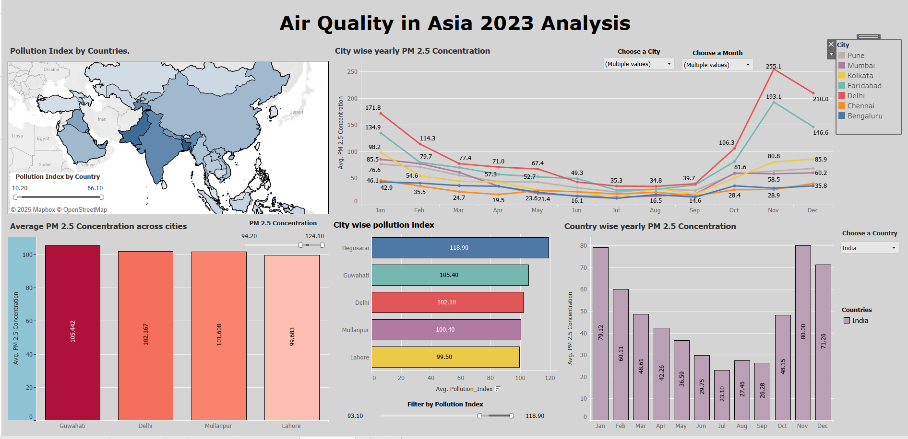
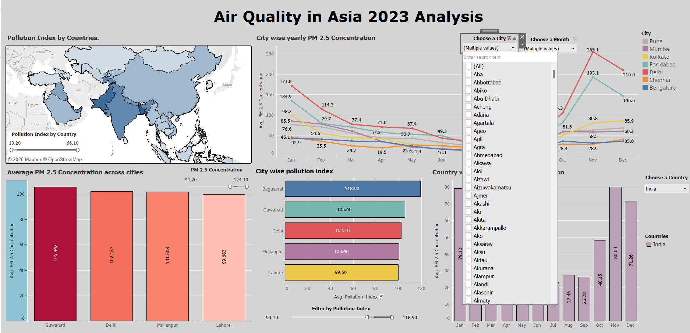
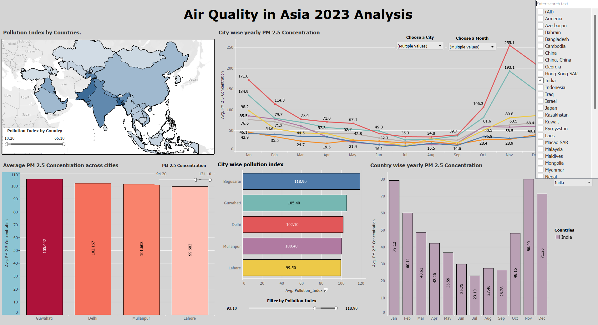

# 🌏 Air Quality in Asia 2023 – Analysis Dashboard

This repository provides an interactive and visual analysis of air pollution across Asia for the year 2023. Built using Tableau, the dashboard offers insights into city-wise and country-wise PM2.5 pollution trends based on a comprehensive dataset covering 2,164 cities across 40+ Asian countries.

---

## 📁 Repository Structure

```
├── Data
│   └── AirQuality Dataset.csv
│
├── Images/
│   ├── Dashboard/
│       ├── main_dashboard.png
│       ├── filter_city.png
│       └── filter_country.png
│   
│       
│       
│
├── Workbook/
│   └── Air_Dash.twb 
|   └── Air_Quality_Dashboard.twbx 
```

---

## 📊 Dashboard Overview



The **Air Quality in Asia 2023 Dashboard** consists of multiple visual components:

### Key Visuals:
- **Pollution Index by Country (Map):** Visualizes the average pollution index for each country.
- **City-Wise Yearly PM2.5 Concentration (Line Chart):** Tracks monthly PM2.5 concentration levels across selected cities.
- **Average PM2.5 Concentration by City (Bar Chart):** Compares the annual PM2.5 concentration across top cities.
- **City-Wise Pollution Index (Horizontal Bar Chart):** Highlights average pollution index by city.
- **Country-Wise Monthly PM2.5 Levels (Stacked Bar Chart):** Displays national monthly PM2.5 concentration trends for selected countries.

### Filters Used:
- **Choose a City** (Multi-select)
- **Choose a Month** (Multi-select)
- **Choose a Country** (Dropdown)
- **Pollution Index Range Slider**
- **PM2.5 Concentration Range Slider**

---

Visual examples:
- 
- 

---

## 📌 Dataset Description

**Source:** Contains air quality information for **2,164 cities** across the following countries in Asia:
> Armenia, Azerbaijan, Bahrain, Bangladesh, Cambodia, China, Georgia, Hong Kong SAR, India, Indonesia, Iraq, Israel, Japan, Kazakhstan, Kuwait, Kyrgyzstan, Laos, Macao SAR, Malaysia, Maldives, Mongolia, Myanmar, Nepal, Pakistan, Palestinian Territory, Philippines, Qatar, Saudi Arabia, Singapore, South Korea, Sri Lanka, Taiwan, Tajikistan, Thailand, Turkey, United Arab Emirates, Uzbekistan, Vietnam.

### Features:
- **City Name**
- **Country**
- **Annual Average PM2.5 Concentration (μg/m³)**
- **Pollution Index (2023)**
- **Monthly PM2.5 Levels** (Jan - Dec)
- **City Ranking Based on Pollution**

---

## 🛠️ Tools & Technologies

- **Tableau Desktop** – for dashboard development and interactivity
- **CSV (Comma-Separated Values)** – as primary dataset format

---

## 📈 Insights Gained
- Identify the most polluted cities and countries in Asia
- Observe seasonal trends in pollution levels
- Compare cities and countries using dynamic filtering
- Evaluate policy implications for high-risk regions

---

## 📂 Tableau Workbook

Located in [`Workbook/`](./Workbook):
- `Air_Quality_Dashboard.twbx ` – Tableau workbook (open with Tableau Desktop)

---

